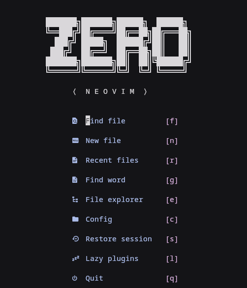

# Neovim Configuration

<div align="center">
  
</div>

A performance-oriented, 2026 standard modular Neovim configuration built on lazy.nvim, featuring modern LSP integration (via native API, conform.nvim), an ultra-fast completion engine (blink.cmp), Git tooling, and a polished UI.

## Overview

This setup is designed for:

- Fast startup through lazy-loading
- Minimal boilerplate with maximal extensibility
- Clean UI with practical developer ergonomics
- Fully managed LSP and tooling via Mason

## Core Features

### Plugin Management

- Lazy-loaded architecture powered by lazy.nvim

### LSP and Tooling

- **Multi-language LSP support**: Configured for Python, TypeScript, Go, C/C++, Rust, XML, **Java/J2EE**
- LSP configuration via nvim-lspconfig
- External tool management via mason.nvim
- Diagnostics integration with trouble.nvim

### Java/J2EE Development

- **JDTLS** (Java Language Server) with full IDE-like support
- **Maven** integration for J2EE/servlet projects
- **Tomcat** remote debugging support
- **JUnit** test runner with test discovery
- **Code generation**: Extract variables/methods, generate constructors, etc.
- See [JAVA_SETUP.md](./JAVA_SETUP.md) for detailed Java development guide

### Autocompletion

- Completion engine: blink.cmp (Blazingly fast 2026 standard)
- Snippets: LuaSnip (integrated with blink.cmp)
- AI assistance: GitHub Copilot (Inline & CopilotChat)

### Syntax Highlighting

- Incremental parsing via nvim-treesitter

### Git Integration

- Inline Git indicators: gitsigns.nvim
- Diff viewer: diffview.nvim
- Git UI: neogit

### UI Enhancements

- Statusline: lualine.nvim
- Bufferline: bufferline.nvim
- Dashboard: dashboard-nvim
- Keybinding hints: which-key.nvim
- Breadcrumbs: dropbar.nvim
- Scrollbar UI: nvim-scrollbar

### Theming

- Base16 theming with automatic color generation via Matugen

## Requirements

Ensure the following dependencies are installed:

- Neovim 0.12+ (Optimized for 2026 native features)
- Git
- Node.js (required for Copilot, CopilotChat, and some LSP servers)
- Ripgrep (required for Telescope live grep)
- fd (recommended for faster file search)
- make (required for native extensions like telescope-fzf-native and CopilotChat)
- A C compiler (required by nvim-treesitter)
- tree-sitter-cli (required for some Treesitter installs)
- Yarn or npm (required for markdown-preview.nvim build)
- Nerd Font (recommended for proper icon rendering)
- lazygit (optional, used by Snacks integration)

## Installation

We provide an interactive installation script that automatically handles dependencies, optional language tools (Java, Python, Go, Rust), features (Lazygit, clipboard integrations), and securely clones the configuration. 

Supported package managers: `apt`, `dnf`, `pacman`, and `brew`.

```sh
# Clone the repository
git clone https://github.com/Yassine5311/neovim.git ~/.config/nvim

# Run the interactive installer
cd ~/.config/nvim
./install.sh
```

Follow the on-screen menu to set up your neovim environment. The script will automatically bootstrap lazy.nvim and install all configured plugins headlessly.

## Key Mappings (Highlights)

| Keybinding | Action |
| --- | --- |
| <leader>ff | Find files |
| <leader>fg | Live grep |
| <leader>gd | Open Diffview |
| <leader>gG | Open Neogit |
| <leader>aa | Copilot Chat |
| <leader>cf | Format buffer |
| <leader>xx | Show diagnostics (Trouble) |

## Matugen Auto-Theming

- matugen-template.lua -> Theme template
- matugen.lua -> Auto-generated file
- Automatically reloads when updated

## Post-Install Notes

- Run :Copilot auth on first use to authenticate.
- Run :TSUpdate if Treesitter parsers are missing.
- Use :Mason to manage external LSP servers and formatters.
